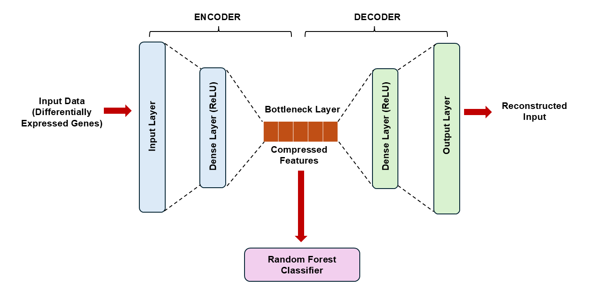

# Hybrid Autoencoder–Random Forest Approach for Cancer Subtype Classification from RNA-Seq Data

## Problem Statement
Cancer is a heterogeneous disease with several subtypes, each associated with a distinct gene expression profile. Subtype classification is essential for guiding personalized treatment. RNA-Seq provides a comprehensive view of gene expression across the transcriptome, making it a powerful tool for this task. However, its high-dimensionality poses a challenge to building computationally efficient classification models.

## Proposed Solution
To tackle the high-dimensionality of RNA-Seq data, this project explores a hybrid autoencoder-random (AE-RF) framework leveraging differentially expressed genes (DEGs). Autoencoder is a a neural network used for unsupervised learning tasks like dimensionality reduction which is a key part of this project. Here, we used an autoencoder to extract a compact set of relevant features from RNA-Seq data for downstream classification by a random forest. To build a simple and efficient autoencoder, we reduced the initial number of input genes by selecting only DEGs from the whole transcriptome.

The proposed approach is demonstrated on TCGA-BRCA breast cancer dataset as an example, but it can be applied to other cancer types with whole-transcriptome RNA-Seq data.

## Methodology

### Dataset
TCGA-BRCA dataset was retrieved from GDC Data Portal using `TCGAbiolinks` R package, and includes whole transcriptome RNA-Seq raw counts and subtype labels of breast cancer patients. The dataset was cleaned, then split into 70% training and 30% test sets. Raw counts were opted instead of TPM- or FPKM-normalized counts for conducting differential gene expression analysis and implementing an appropriate normalization pipeline for downstream machine learning models.

### Differentially Expressed Gene (DEG) Identification
DEGs were identified from the raw counts of the training set using `DESeq2` R package. Breast cancer has four major molecular subtypes: Luminal A, Luminal B, HER2-enriched and Basal-like. Here are the steps performed for finding DEGs of the subtypes after running DESeq2 differential gene expression analysis:

1. For each reference subtype, perform pairwise comparison with each of the other subtypes.
2. Identify upregulated and downregulated genes for each pairwise comparison based on:
   * Log2 fold change > 1 and < −1 for biological significance
   * Adjusted p-value < 0.05 for statistical significance.
3. Retain only genes that are consistently up- or downregulated across all comparisons with the reference subtype.
4. Combine DEGs from all subtypes to obtain a final set of genes for model training.

### AE-RF Model Architecture


Autoencoder and random forest were implemented using Python libraries `TensorFlow` and `scikit-learn` respectively.

Autoencoder:

The autoencoder comprises encoder, decoder and bottleneck layer. The encoder compresses input features (DEGs in this case) into a lower-dimensional representation matching the bottleneck layer size. The decoder then reconstructs the input data from the bottleneck layer’s compressed features. During autoencoder training, the bottleneck layer learns features that minimize the reconstruction error between the input and reconstructured output. The architecture of the autoencoder is kept simple with only one dense layer in encoder and decoder each, since the initial input dimension has been reduced by 

Random Forest:

The random forest is an ensemble machine learning model that is easy to train; is not sensitive to feature scaling; and can learn complex non-linear relationships. In this framework, random forest is trained on the bottleneck layer's features for subtype classification.

## Code Files
*  [`tcga_brca_gdc_retrieval.R`](R_scripts/tcga_brca_gdc_retrieval.R) – Retrieves TCGA-BRCA data from GDC Data Portal using `TCGAbiolinks`.  
*  [`data_cleaning_splitting.ipynb`](jupyter_notebooks/data_cleaning_splitting.ipynb) – Cleans the TCGA-BRCA dataset and splits it into training and test sets.
*  [`finding_degs_using_deseq2.R`](R_scripts/finding_degs_using_deseq2.R) – Finds DEGs from the whole transcriptome using `DESeq2`. 
*  [`AE_RF_classification.ipynb`](jupyter_notebooks/AE_RF_classification.ipynb) – Provides a detailed workflow on feature engineering, AE-RF model training, cross-validation, test set evaluation, and model performance analysis

## Environment Setup

This project uses both R (for data retrieval and DEG analysis) and Python (for data preprocessing, AE-RF model training and evaluation).  
The required dependencies for each environment are provided in the repository.

1. R Environment
Dependencies are specified in the [`renv.lock`](renv.lock) file. Open an R session, and run:

```r
install.packages("renv")
renv::restore(lockfile = "/path/to/your/renv.lock")
```

2. Python Environment
Dependencies are specified in the [`environment.yml`](environment.yml) file. Execute the following code in your terminal:

```bash
conda env create -f environment.yml
conda activate breast_subtype_ae_proj_env
```

## References
1. [Bioinformagician: Tutorial on TCGA Data Retrieval using TCGAbiolinks R package](https://www.youtube.com/watch?v=UWXv9dUpxNE&t=26s)
2. [Bioinformagician: Tutorial on DESeq2 Differential Gene Expression Analysis](https://www.youtube.com/watch?v=OzNzO8qwwp0)
3. [Tutorial on Autoencoder Feature Extraction for Classification](https://machinelearningmastery.com/autoencoder-for-classification/)
4. Related papers on breast cancer subtype classification with autoencoders:
    * [AFExNet: An Adversarial Autoencoder for Differentiating Breast Cancer Sub-types and Extracting Biologically Relevant Genes](https://ieeexplore.ieee.org/abstract/document/9378938)
    * [Deep Learning Based Model for Breast Cancer Subtype Classification](https://arxiv.org/abs/2111.03923)
    * [Moanna: Multi-Omics Autoencoder-Based Neural Network Algorithm for Predicting Breast Cancer Subtypes](https://ieeexplore.ieee.org/document/10029336)
